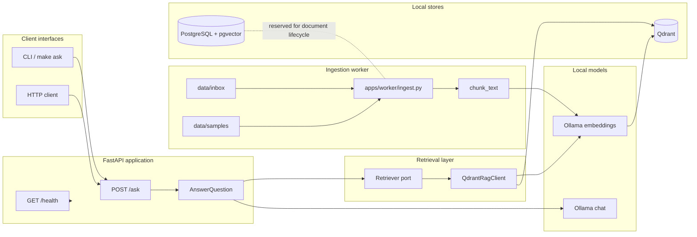
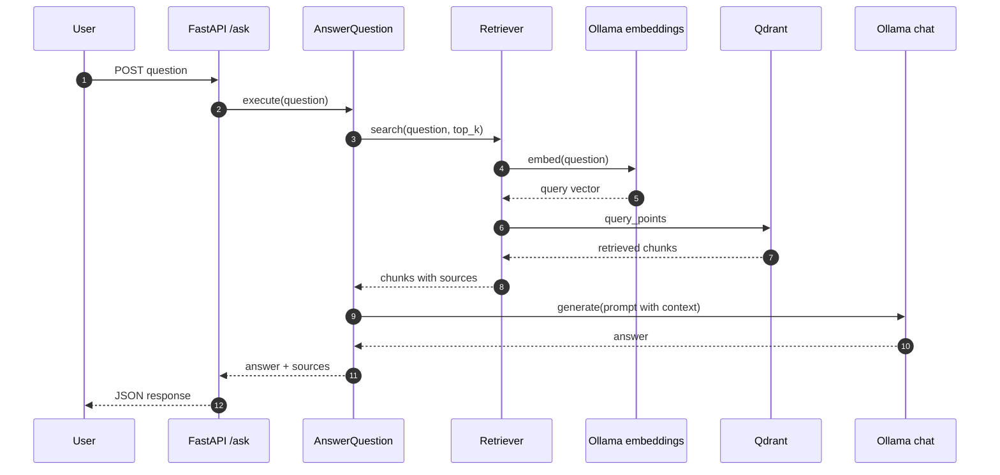

<p align="center">
  
</p>

<p align="center">
  
  
  
  
  
  
</p>

# DevMind OS

DevMind OS is a local-first RAG assistant for indexing technical knowledge and
answering questions with source-backed context. The project is an MVP focused on
engineering discipline: typed configuration, explicit application boundaries,
local model execution, retrieval evaluation, and reproducible validation.

The system does not send documents or prompts to hosted model providers by
default. It runs with FastAPI, Ollama, Qdrant, and Docker Compose.

## What It Does Today

| Capability | Status |
| --- | --- |
| HTTP API for questions | Available through `POST /ask` |
| CLI question client | Available through `make ask` |
| Local document ingestion | Markdown and text files |
| Chunking | Configurable size and overlap |
| Embeddings | Local Ollama embedding model |
| Vector retrieval | Qdrant collection |
| Answer generation | Local Ollama chat model |
| Source reporting | Returned in the `/ask` response |
| Retrieval evaluation | Smoke baseline with `Recall@k` and MRR |
| PostgreSQL | Provisioned for future document lifecycle work |

## Architecture



## Runtime Flow



## Engineering Posture

| Principle | Current implementation |
| --- | --- |
| Local-first by default | Ollama and Qdrant run locally |
| Small public contracts | `Retriever`, `Generator`, and response models are explicit |
| Reproducible checks | `make check` runs lint, typecheck, tests, and Compose config |
| Measurable RAG changes | Retrieval evaluation emits `Recall@k`, MRR, and per-case sources |
| Incremental architecture | Roadmap documents phases, constraints, and out-of-scope items |
| Privacy-aware defaults | Logs and reports avoid document contents by default |

## Latest Local Evidence

The following evidence was collected from a local E2E run on 2026-06-24:

| Check | Result |
| --- | --- |
| Sample ingestion | `2/2` files, `2` chunks |
| Retrieval evaluation | `Recall@2 = 1.0`, `MRR = 0.75`, `2` cases |
| API health | HTTP 200 |
| API question flow | HTTP 200, answer `Farol Verde.` |
| CLI question flow | answer `Farol Verde.` |
| Automated checks | Ruff, mypy, pytest, and Compose config passed |

This is a smoke baseline, not a production benchmark.

## Documentation

| Document | Purpose |
| --- | --- |
| [Architecture Roadmap](docs/architecture-roadmap.md) | System direction, phases, risks, and planned evolution |
| [Retrieval Evaluation](docs/retrieval-evaluation.md) | Evaluation scope, metrics, commands, evidence, and review guidance |

## Stack

| Layer | Technology |
| --- | --- |
| Language | Python 3.11+ |
| API | FastAPI, Pydantic |
| Local models | Ollama |
| Vector store | Qdrant |
| Future system of record | PostgreSQL with pgvector |
| Quality | pytest, Ruff, mypy |
| Tooling | uv, Docker Compose, Make |

## Requirements

- [Python 3.11 or higher](https://www.python.org/)
- [uv](https://docs.astral.sh/uv/)
- [Docker with Compose](https://docs.docker.com/compose/)
- [Ollama](https://ollama.com/)

## Quick Start

Install dependencies:

```bash
uv sync
```

Pull the local models used by default:

```bash
ollama pull llama3.2:1b
ollama pull nomic-embed-text
```

Start PostgreSQL and Qdrant:

```bash
make up
make ps
```

Start the API in another terminal:

```bash
make api
```

Validate the service:

```bash
curl http://localhost:8000/health
```

Interactive API documentation is available at:

```text
http://localhost:8000/docs
```

## Ask a Question

With the API and Ollama running:

```bash
make ask q="Qual e o status do projeto?"
```

You can also call the API directly:

```bash
curl -X POST http://localhost:8000/ask \
  -H "Content-Type: application/json" \
  -d '{"question":"Qual e o status do projeto?"}'
```

Response shape:

```json
{
  "answer": "...",
  "sources": [
    {
      "chunk_id": "...",
      "document_id": null,
      "file_path": "data/inbox/notes/status.md",
      "chunk_index": 0,
      "score": 0.91
    }
  ]
}
```

## Ingest Documents

Add `.md`, `.markdown`, or `.txt` files to `data/inbox` and run:

```bash
make ingest
```

To load the versioned smoke-test documents:

```bash
make ingest-samples
```

The ingestion pipeline:

1. ignores unsupported extensions and empty files;
2. splits content into chunks;
3. generates embeddings with the configured Ollama model;
4. creates the Qdrant collection when needed;
5. stores text, vector, file path, file name, and chunk index.

Point IDs are deterministic by file path and chunk index. Re-ingesting the same
path updates the corresponding points.

## Evaluate Retrieval

Run the retrieval baseline after starting local dependencies and ingesting the
sample documents:

```bash
make eval
```

Use a different retrieval limit when comparing ranking behavior:

```bash
make eval args="--top-k 8"
```

The evaluator loads `data/evaluation/retrieval-baseline.json`, queries the
configured retriever, and prints a JSON report with `Recall@k`, MRR, and source
metadata.

## Configuration

The application reads settings from process environment variables. `.env.example`
documents the available values.

| Variable | Default | Purpose |
| --- | --- | --- |
| `APP_ENV` | `local` | Reserved environment label |
| `API_BASE_URL` | `http://localhost:8000` | Base URL used by the CLI client |
| `OLLAMA_BASE_URL` | `http://localhost:11434` | Ollama endpoint |
| `OLLAMA_CHAT_MODEL` | `llama3.2:1b` | Chat model used by `/ask` |
| `OLLAMA_EMBED_MODEL` | `nomic-embed-text` | Embedding model used by ingestion and retrieval |
| `QDRANT_URL` | `http://localhost:6333` | Qdrant endpoint |
| `QDRANT_COLLECTION` | `devmind_documents` | Vector collection name |
| `RAG_CHUNK_SIZE` | `1000` | Maximum chunk size in characters |
| `RAG_CHUNK_OVERLAP` | `100` | Character overlap between chunks |
| `POSTGRES_DSN` | see `.env.example` | Reserved for future persistence |

`RAG_CHUNK_OVERLAP` must be smaller than `RAG_CHUNK_SIZE`.

## Commands

| Command | Description |
| --- | --- |
| `make up` | Start Docker Compose services |
| `make down` | Stop Docker Compose services |
| `make logs` | Follow service logs |
| `make ps` | Show container status |
| `make api` | Start the development API |
| `make ask q="..."` | Send a question to the API |
| `make ingest` | Index documents from `data/inbox` |
| `make ingest-samples` | Index sample documents from `data/samples` |
| `make eval` | Run the retrieval smoke baseline |
| `make test` | Run automated tests |
| `make lint` | Run Ruff |
| `make typecheck` | Run mypy |
| `make check` | Run lint, typecheck, tests, and Compose config |

## Project Layout

```text
apps/
├── api/                # HTTP API and CLI client
└── worker/             # Ingestion and evaluation entrypoints
data/
├── evaluation/         # Versioned retrieval datasets
├── inbox/              # Local documents waiting for ingestion
├── processed/          # Reserved processed-document area
└── samples/            # Versioned sample documents for smoke tests
docs/
├── architecture-roadmap.md
└── retrieval-evaluation.md
packages/
├── application/        # Use cases and application ports
├── domain/             # Domain models
├── rag/                # Chunking, Qdrant integration, evaluation
└── shared/             # Shared integrations and configuration
tests/                  # Automated tests
```

## Development

Before opening a change:

```bash
make check
```

Changes should be small, tested, and explicit about public contract impact.
Do not commit secrets, private documents, real `.env` files, or sensitive
content from indexed data.

## Known Limitations

| Limitation | Current impact |
| --- | --- |
| Ingestion is not document-lifecycle aware | Old chunks are not removed when files shrink or disappear |
| PostgreSQL is provisioned but unused | Document versioning and ingestion runs are not persisted yet |
| No authentication or authorization | Run only in a trusted local environment |
| Retrieval baseline is small | Metrics are smoke signals, not broad quality claims |
| Readiness and observability are basic | Health does not yet represent dependency health |

## License

This repository does not define a distribution license yet.
