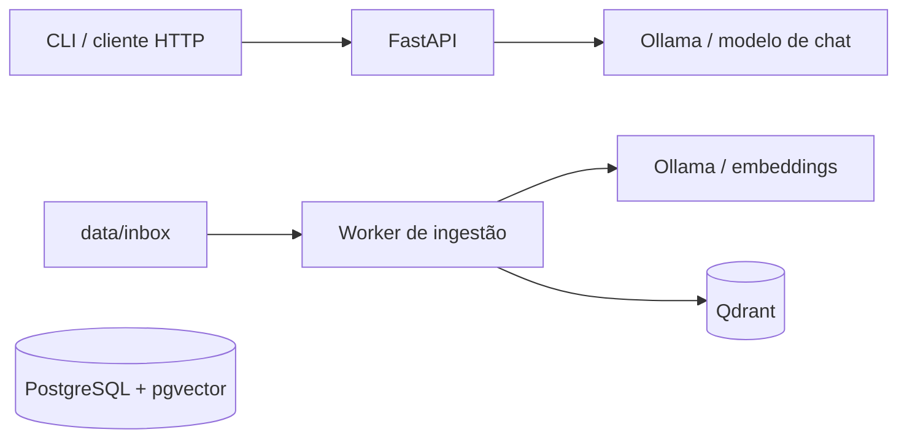

# DevMind OS

Assistente local e experimental para organizar conhecimento técnico e consultar
modelos de linguagem sem enviar dados para provedores externos.

O projeto está em fase de MVP. Hoje ele oferece uma API de perguntas conectada
ao Ollama e um pipeline independente para indexar documentos locais no Qdrant.
A recuperação dos documentos indexados ainda não está integrada ao endpoint
`/ask`.

## Capacidades atuais

- API HTTP com health check e geração de respostas via Ollama.
- Cliente de linha de comando para consultar a API.
- Ingestão de arquivos Markdown e texto.
- Chunking configurável com sobreposição.
- Geração local de embeddings via Ollama.
- Armazenamento vetorial no Qdrant.
- PostgreSQL com pgvector provisionado para evolução futura.

## Arquitetura



O fluxo de consulta e o fluxo RAG são independentes nesta versão:

1. `POST /ask` envia a pergunta diretamente ao modelo de chat.
2. `make ingest` lê documentos, cria chunks, gera embeddings e grava os vetores
   no Qdrant.

## Stack

- Python 3.11+
- FastAPI e Pydantic
- Ollama
- Qdrant
- PostgreSQL com pgvector
- pytest e Ruff
- uv
- Docker Compose

## Pré-requisitos

- [Python 3.11 ou superior](https://www.python.org/)
- [uv](https://docs.astral.sh/uv/)
- [Docker com Compose](https://docs.docker.com/compose/)
- [Ollama](https://ollama.com/)

## Início rápido

Instale as dependências:

```bash
uv sync
```

Baixe os modelos usados pelo projeto:

```bash
ollama pull llama3.2:1b
ollama pull nomic-embed-text
```

Inicie PostgreSQL e Qdrant:

```bash
make up
make ps
```

Inicie a API em outro terminal:

```bash
make api
```

Valide o serviço:

```bash
curl http://localhost:8000/health
```

A documentação interativa da API fica disponível em
<http://localhost:8000/docs>.

## Consultar o assistente

Com a API e o Ollama em execução:

```bash
make ask q="Qual é o status do projeto?"
```

Também é possível usar a API diretamente:

```bash
curl -X POST http://localhost:8000/ask \
  -H "Content-Type: application/json" \
  -d '{"question":"Qual é o status do projeto?"}'
```

Resposta esperada:

```json
{
  "answer": "..."
}
```

## Ingestão de documentos

Adicione arquivos `.md`, `.markdown` ou `.txt` em `data/inbox` e execute:

```bash
make ingest
```

O pipeline:

1. ignora extensões não suportadas e arquivos vazios;
2. divide o conteúdo em chunks;
3. gera embeddings com o modelo configurado no Ollama;
4. cria a coleção no Qdrant quando necessário;
5. persiste texto, vetor, caminho, nome do arquivo e índice do chunk.

Os identificadores dos pontos são determinísticos por caminho e índice. Uma
nova ingestão do mesmo conteúdo atualiza os pontos correspondentes.

O Qdrant expõe a API em <http://localhost:6333> e o dashboard em
<http://localhost:6333/dashboard>.

## Configuração

O arquivo `.env.example` documenta as variáveis disponíveis. A aplicação lê
variáveis do ambiente do processo; exporte os valores antes de executar os
comandos quando quiser substituir os padrões.

| Variável | Padrão | Finalidade |
| --- | --- | --- |
| `APP_ENV` | `local` | Reservado para identificar o ambiente. |
| `API_BASE_URL` | `http://localhost:8000` | Endereço usado pelo cliente CLI. |
| `OLLAMA_BASE_URL` | `http://localhost:11434` | Endereço do Ollama. |
| `OLLAMA_CHAT_MODEL` | `llama3.2:1b` | Modelo usado pelo endpoint `/ask`. |
| `OLLAMA_EMBED_MODEL` | `nomic-embed-text` | Modelo usado na ingestão. |
| `QDRANT_URL` | `http://localhost:6333` | Endereço do Qdrant. |
| `QDRANT_COLLECTION` | `devmind_documents` | Coleção vetorial do projeto. |
| `RAG_CHUNK_SIZE` | `1000` | Tamanho máximo de cada chunk, em caracteres. |
| `RAG_CHUNK_OVERLAP` | `100` | Sobreposição entre chunks, em caracteres. |
| `POSTGRES_DSN` | consulte `.env.example` | Reservado para persistência futura. |

`RAG_CHUNK_OVERLAP` deve ser menor que `RAG_CHUNK_SIZE`.

## Comandos

| Comando | Descrição |
| --- | --- |
| `make up` | Inicia os serviços do Docker Compose. |
| `make down` | Encerra os serviços. |
| `make logs` | Acompanha os logs dos serviços. |
| `make ps` | Exibe o estado dos containers. |
| `make api` | Inicia a API em modo de desenvolvimento. |
| `make ask q="..."` | Envia uma pergunta para a API. |
| `make ingest` | Indexa os documentos de `data/inbox`. |
| `make test` | Executa os testes automatizados. |
| `make lint` | Executa a análise estática com Ruff. |

## Estrutura do projeto

```text
apps/
├── api/                # API HTTP e cliente CLI
└── worker/             # Pipeline de ingestão
data/
├── inbox/              # Documentos aguardando ingestão
└── processed/          # Área reservada para documentos processados
packages/
├── rag/                # Chunking e integração com Qdrant
└── shared/             # Integrações compartilhadas, como Ollama
tests/                  # Testes automatizados
```

## Desenvolvimento e validação

Antes de abrir uma mudança:

```bash
make test
make lint
docker compose config
```

Mantenha as alterações pequenas, inclua testes para mudanças de comportamento
e nunca versione credenciais ou dados sensíveis.

## Limitações conhecidas

- O endpoint `/ask` ainda não recupera contexto do Qdrant.
- A ingestão não remove pontos antigos quando um documento passa a ter menos
  chunks ou é excluído.
- PostgreSQL está provisionado, mas ainda não participa dos fluxos da aplicação.
- Não há autenticação ou autorização; execute apenas em ambiente local confiável.
- Observabilidade e processamento incremental ainda são básicos.

## Licença

Este repositório ainda não define uma licença de distribuição.
