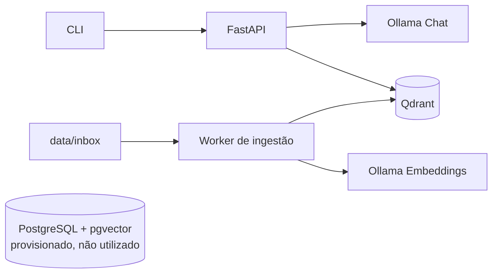
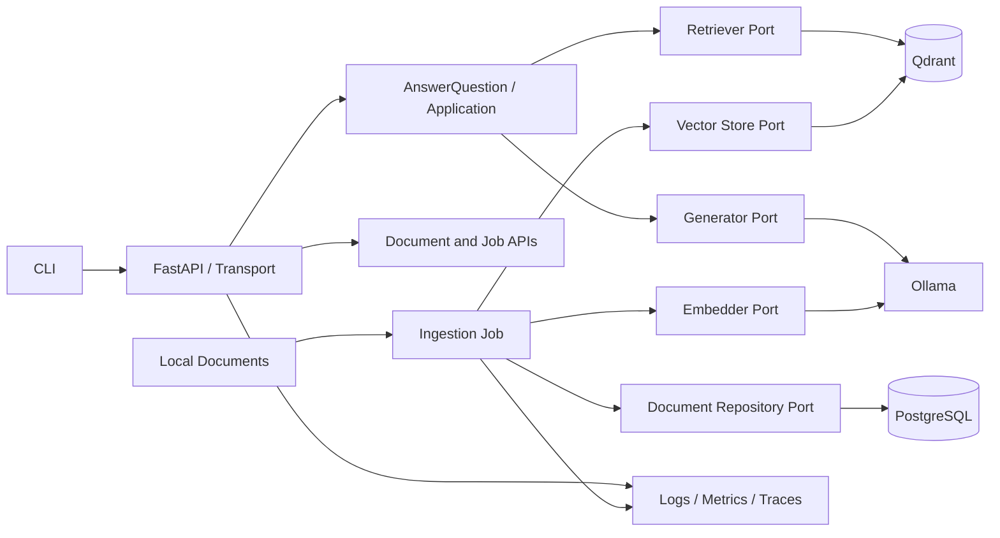
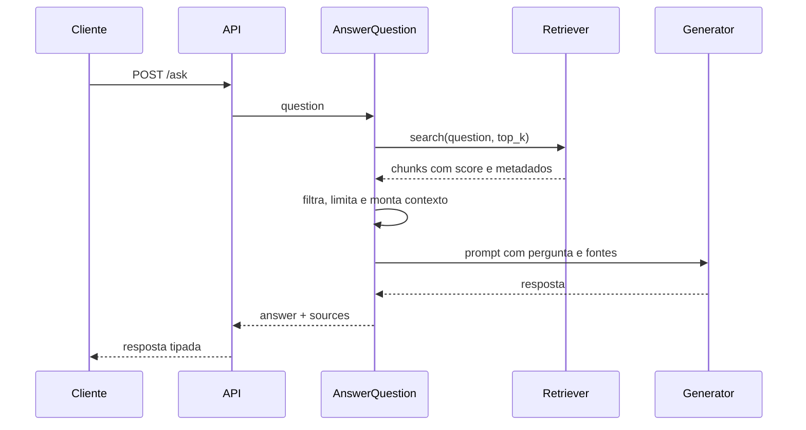
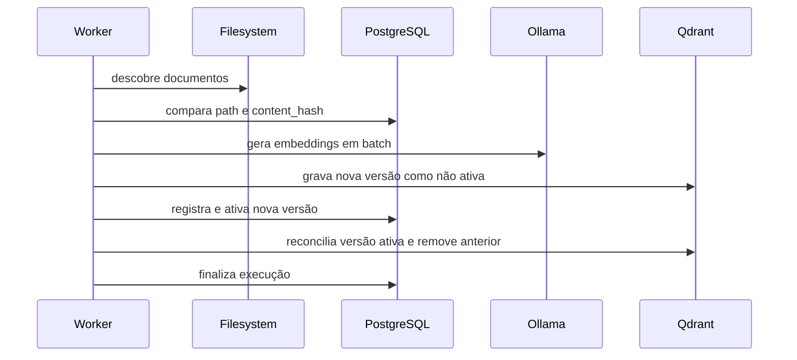

# Arquitetura e Roadmap de Implementação

## 1. Propósito

Este documento define a direção arquitetural do DevMind OS e organiza sua
evolução de um MVP de aprendizado para um sistema local confiável, testável,
observável e operável.

O roadmap é incremental. Cada fase deve entregar valor utilizável, preservar os
contratos existentes sempre que possível e produzir evidências objetivas antes
de aumentar a complexidade.

## 2. Estado atual

O DevMind OS possui dois fluxos principais:

1. o endpoint `POST /ask` busca contexto no Qdrant e envia prompt enriquecido
   ao modelo de chat no Ollama;
2. o worker de ingestão lê documentos locais, cria chunks, gera embeddings e
   grava os vetores no Qdrant.



### Capacidades existentes

- API HTTP e CLI para perguntas.
- Integração local com Ollama.
- Recuperação de contexto no Qdrant para `/ask`.
- Ingestão de Markdown e texto.
- Chunking configurável.
- Identificadores determinísticos de chunks.
- Persistência vetorial no Qdrant.
- Testes unitários dos principais fluxos.
- Lint e typecheck.
- Infraestrutura local com Docker Compose.

### Lacunas principais

- A ingestão não remove chunks obsoletos nem controla versões de documentos.
- Não existe registro persistente de documentos ou execuções de ingestão.
- Não há avaliação objetiva da qualidade do RAG.
- Health check, logs e métricas não representam a saúde das dependências.
- Não há CI, empacotamento da aplicação ou procedimento de recuperação.
- Existem dependências ainda sem uso e decisões arquiteturais não registradas.

## 3. Princípios arquiteturais

### 3.1 Simplicidade antes de distribuição

O sistema continuará como um monólito modular enquanto não houver evidência de
que serviços independentes resolvem um problema real de escala, isolamento ou
ownership.

### 3.2 Dependências apontam para os casos de uso

FastAPI, Qdrant, Ollama, PostgreSQL e sistema de arquivos são detalhes externos.
Os casos de uso devem depender de contratos pequenos e explícitos, permitindo
testes sem infraestrutura real.

### 3.3 PostgreSQL e Qdrant têm responsabilidades diferentes

- PostgreSQL será a fonte de verdade para documentos, versões, execuções,
  estado operacional e auditoria.
- Qdrant será uma projeção reconstruível e otimizada para busca vetorial.

O pgvector não será utilizado em paralelo com o Qdrant sem benchmark e ADR que
justifiquem o custo de operar duas soluções vetoriais.

### 3.4 Local-first e privacidade por padrão

Conteúdo de documentos, perguntas e respostas não deve sair da máquina sem uma
decisão explícita de produto e arquitetura. Logs não devem registrar conteúdo
sensível por padrão.

### 3.5 Qualidade mensurável

Mudanças em chunking, embeddings, recuperação, prompt ou modelo precisam ser
avaliadas por métricas e datasets versionados. Preferências subjetivas não são
critério suficiente para alterar o pipeline.

### 3.6 Evolução incremental e reversível

Cada fase deve:

- caber em pull requests pequenos;
- preservar comportamento anterior ou documentar a quebra;
- possuir critérios de aceite;
- incluir testes proporcionais ao risco;
- permitir rollback sem migração destrutiva.

## 4. Arquitetura-alvo



### Camadas e responsabilidades

#### Transportes

- Recebem e validam entradas HTTP ou CLI.
- Convertem erros de aplicação em respostas apropriadas.
- Não contêm regras de recuperação, prompt ou ingestão.

#### Aplicação

- Orquestra casos de uso como `AnswerQuestion`, `IngestDocument` e
  `ReconcileDocuments`.
- Define transações e políticas de erro.
- Depende de ports, não de SDKs externos.

#### Domínio

- Contém modelos e invariantes de documentos, versões, chunks, fontes e jobs.
- Não depende de FastAPI, Qdrant, Ollama ou SQLAlchemy.
- Deve permanecer pequeno; abstrações só serão adicionadas quando houver uma
  regra real a proteger.

#### Adaptadores

- Implementam acesso ao Ollama, Qdrant, PostgreSQL e filesystem.
- Convertem erros dos provedores em erros conhecidos pela aplicação.
- Centralizam timeouts, retries, serialização e observabilidade externa.

### Contratos iniciais

Os nomes são direcionais e podem ser ajustados durante a implementação.

```python
class Generator(Protocol):
    async def generate(self, prompt: str) -> str: ...


class Embedder(Protocol):
    async def embed(self, texts: list[str]) -> list[list[float]]: ...


class Retriever(Protocol):
    async def search(self, query: str, *, limit: int) -> list[RetrievedChunk]: ...


class VectorStore(Protocol):
    async def replace_document_chunks(
        self,
        document_version: DocumentVersion,
        chunks: list[EmbeddedChunk],
    ) -> None: ...


class DocumentRepository(Protocol):
    async def get_by_path(self, path: str) -> Document | None: ...
    async def save_version(self, version: DocumentVersion) -> None: ...
```

Não se deve criar uma interface para cada classe. Ports existem nos limites
onde testes, substituição de infraestrutura ou isolamento de falhas justificam
a abstração.

## 5. Fluxos-alvo

### 5.1 Consulta RAG



Políticas esperadas:

- não inventar resposta quando o contexto for insuficiente;
- delimitar claramente instruções e conteúdo recuperado;
- retornar fontes com identificador, caminho e trecho;
- limitar quantidade e tamanho do contexto;
- preservar o campo `answer` para compatibilidade.

### 5.2 Ingestão e reconciliação



Requisitos:

- reprocessamento idempotente;
- hash do conteúdo para detectar alterações;
- isolamento de falha por documento;
- remoção de chunks obsoletos;
- rastreabilidade de início, fim, resultado e erro;
- capacidade de reconstruir o índice vetorial a partir da fonte de verdade.

PostgreSQL e Qdrant não compartilham uma transação. A implementação não deve
prometer atomicidade entre os dois bancos. A consistência será obtida por
versionamento, operações idempotentes, estado intermediário não pesquisável e
reconciliação com compensação após falhas. A política exata deve ser registrada
em ADR antes da implementação da Fase 2.

## 6. Modelo de dados inicial

### Document

- `id`
- `source_type`
- `source_path`
- `created_at`
- `updated_at`
- `deleted_at`

### DocumentVersion

- `id`
- `document_id`
- `content_hash`
- `size_bytes`
- `status`
- `created_at`
- `activated_at`

### IngestionRun

- `id`
- `status`
- `started_at`
- `finished_at`
- `files_seen`
- `files_ingested`
- `chunks_ingested`
- `error_count`

### IngestionItem

- `id`
- `run_id`
- `document_id`
- `status`
- `error_code`
- `error_detail`

Detalhes de erro persistidos devem ser sanitizados. Conteúdo integral de
documentos não deve ser salvo em mensagens de erro.

## 7. Estrutura de código desejada

A migração será gradual; não é necessário mover todo o projeto em um único PR.

```text
apps/
├── api/
│   ├── main.py
│   ├── dependencies.py
│   └── routes/
└── worker/
    └── ingest.py
packages/
├── application/
│   ├── answer_question.py
│   └── ingest_documents.py
├── domain/
│   ├── documents.py
│   └── retrieval.py
├── infrastructure/
│   ├── ollama/
│   ├── postgres/
│   └── qdrant/
├── rag/
│   ├── chunking.py
│   ├── prompting.py
│   └── evaluation.py
└── shared/
    ├── config.py
    ├── errors.py
    └── observability.py
tests/
├── unit/
├── integration/
└── evaluation/
```

Esta estrutura é um destino, não uma obrigação imediata. Arquivos existentes
devem ser movidos apenas quando a fase correspondente exigir a separação.

## 8. Roadmap por fases

### Fase 0 — Baseline de engenharia

**Objetivo:** tornar a base previsível antes de integrar novos fluxos.

**Incrementos sugeridos:**

1. Centralizar configurações em `pydantic-settings`, com validação na
   inicialização.
2. Introduzir app factory e dependency injection no FastAPI.
3. Extrair o caso de uso atual de resposta sem alterar o contrato de `/ask`.
4. Centralizar erros de integração e timeouts.
5. Adicionar `make typecheck` e `make check`.
6. Criar CI para testes, Ruff, mypy e validação do Compose.
7. Fixar versões das imagens Docker.
8. Remover dependências sem uso ou registrar a decisão de mantê-las.
9. Remover o `main.py` residual ou transformá-lo em entrypoint válido.

**Arquivos prováveis:**

- `apps/api/main.py`
- `apps/api/dependencies.py`
- `packages/application/answer_question.py`
- `packages/shared/config.py`
- `packages/shared/errors.py`
- `pyproject.toml`
- `Makefile`
- `docker-compose.yml`
- `.github/workflows/ci.yml`

**Critérios de saída:**

- `/ask` mantém o comportamento público atual.
- Casos de uso são testáveis sem monkeypatch de classes globais.
- Configuração inválida falha com mensagem clara.
- CI executa todos os checks obrigatórios.
- Dependências e imagens possuem versões intencionais.

**Fora de escopo:** retrieval, migrations e autenticação.

### Fase 1 — Ciclo RAG completo

**Objetivo:** responder usando o conhecimento indexado e apresentar evidências.

**Incrementos sugeridos:**

1. Implementar busca vetorial no adaptador do Qdrant.
2. Criar os modelos `RetrievedChunk` e `Source`.
3. Criar o port `Retriever`.
4. Implementar `AnswerQuestion` com recuperação, prompt e geração.
5. Adicionar `sources` ao contrato de resposta.
6. Definir fallback quando não houver contexto suficiente.
7. Adicionar filtros de score, `top_k` e limite de contexto configuráveis.
8. Criar testes de integração com Qdrant.

**Contrato de resposta pretendido:**

```json
{
  "answer": "Resposta baseada nos documentos.",
  "sources": [
    {
      "document_id": "…",
      "file_path": "data/inbox/notes/status.md",
      "chunk_index": 0,
      "score": 0.91
    }
  ]
}
```

**Critérios de saída:**

- Uma pergunta conhecida recupera o documento esperado.
- A resposta retorna fontes rastreáveis.
- Ausência de contexto possui comportamento explícito e testado.
- Falhas no Qdrant e Ollama produzem erros HTTP consistentes.
- O campo `answer` permanece compatível com o cliente atual.

**Fora de escopo:** reranking, busca híbrida e memória conversacional.

### Fase 2 — Ingestão idempotente e lifecycle de documentos

**Objetivo:** garantir consistência após criação, alteração e remoção de
documentos.

**Incrementos sugeridos:**

1. Introduzir `document_id`, `content_hash` e `document_version_id`.
2. Persistir documento, versão e execução no PostgreSQL.
3. Adicionar migrations versionadas.
4. Gerar embeddings em batches com concorrência limitada.
5. Implementar ativação versionada e reconciliação dos chunks de um documento.
6. Remover chunks de versões antigas e documentos excluídos.
7. Registrar falhas por documento sem abortar toda a execução.
8. Adicionar comando de reconstrução completa do índice.

**Critérios de saída:**

- Reingerir conteúdo inalterado não gera trabalho ou dados duplicados.
- Reduzir o tamanho de um documento não deixa chunks órfãos.
- Excluir um documento remove sua projeção de busca.
- Uma falha isolada não invalida documentos processados com sucesso.
- O índice do Qdrant pode ser reconstruído.
- Falhas entre escritas no PostgreSQL e Qdrant convergem por reconciliação.

**Fora de escopo:** fila distribuída e processamento em múltiplos hosts.

### Fase 3 — Avaliação e qualidade do RAG

**Objetivo:** tornar decisões sobre recuperação e geração mensuráveis.

**Incrementos sugeridos:**

1. Criar dataset versionado de perguntas, documentos e fatos esperados.
2. Implementar execução offline de avaliação.
3. Medir Recall@k, MRR, taxa de ausência de contexto e latência.
4. Validar presença de citações e suporte factual.
5. Salvar baseline por configuração de chunking, embedding e modelo.
6. Adicionar gate de regressão para métricas determinísticas.

**Critérios de saída:**

- Existe uma baseline reproduzível.
- Mudanças no retrieval apresentam comparação antes/depois.
- O dataset cobre sucesso, ambiguidade, ausência de resposta e conflito.
- Métricas não determinísticas são informativas, não gates frágeis de CI.

**Fora de escopo:** otimização automática de prompts e avaliação apenas por
outro LLM.

### Fase 4 — Observabilidade e resiliência

**Objetivo:** diagnosticar comportamento e falhas sem depender de debugger.

**Incrementos sugeridos:**

1. Adicionar logs estruturados com request ID e ingestion run ID.
2. Separar liveness de readiness.
3. Medir latência e erros por dependência.
4. Medir chunks recuperados, score e tamanho de contexto sem registrar conteúdo.
5. Definir timeouts por operação.
6. Implementar retries apenas para falhas transitórias e operações idempotentes.
7. Adicionar graceful shutdown e reutilização de clientes HTTP.

**Critérios de saída:**

- Uma requisição pode ser rastreada entre API e adaptadores.
- Readiness falha quando uma dependência obrigatória está indisponível.
- Timeouts e retries são limitados, configuráveis e testados.
- Logs não expõem perguntas, respostas ou documentos por padrão.

**Fora de escopo:** stack distribuída de tracing sem necessidade demonstrada.

### Fase 5 — Operação do worker

**Objetivo:** transformar a ingestão em um processo operacional controlável.

**Incrementos sugeridos:**

1. Criar API ou CLI de criação e consulta de jobs.
2. Implementar claim de job e transições de estado no PostgreSQL.
3. Adicionar retry manual e automático com limite.
4. Registrar motivo final de falha.
5. Implementar cancelamento cooperativo.
6. Definir política de retenção do histórico.

**Critérios de saída:**

- Jobs sobrevivem ao reinício do worker.
- Dois workers não processam o mesmo job simultaneamente.
- Operações podem consultar progresso e falhas.
- Retry não duplica documentos ou chunks.

**Fora de escopo:** adotar Redis, Kafka ou RabbitMQ sem evidência de necessidade.

### Fase 6 — Segurança e privacidade

**Objetivo:** explicitar o modelo de ameaça e proteger os limites do sistema.

**Incrementos sugeridos:**

1. Documentar threat model local-first.
2. Limitar tamanho de perguntas, arquivos e payloads.
3. Validar caminhos e impedir traversal ou acesso fora das raízes permitidas.
4. Definir CORS restritivo.
5. Sanitizar erros e logs.
6. Exigir autenticação e TLS quando houver exposição fora de loopback.
7. Impedir credenciais padrão de desenvolvimento em perfis não locais.
8. Executar análise de dependências e secret scanning no CI.

**Critérios de saída:**

- Controles possuem testes negativos.
- Nenhum conteúdo sensível aparece em logs normais.
- Bind de rede e autenticação seguem o perfil de execução.
- Perfis não locais falham ao iniciar com credenciais padrão.
- Dependências vulneráveis possuem processo de triagem.

**Fora de escopo:** exposição pública sem TLS, autenticação e hardening.

### Fase 7 — Empacotamento, entrega e recuperação

**Objetivo:** permitir instalação e operação reproduzíveis por outra pessoa.

**Incrementos sugeridos:**

1. Criar Dockerfile da API e do worker.
2. Adicionar health checks e perfis ao Compose.
3. Definir estratégia de migrations na inicialização.
4. Documentar backup e restore de PostgreSQL e Qdrant.
5. Criar runbook de incidentes comuns.
6. Definir versionamento, changelog e processo de release.
7. Validar instalação limpa em CI ou ambiente efêmero.

**Critérios de saída:**

- Ambiente limpo sobe com procedimento documentado.
- Backup e restore são testados.
- Upgrade e rollback possuem instruções.
- Serviços executam com usuário não privilegiado quando containerizados.

### Fase 8 — Capacidades avançadas orientadas por evidência

**Objetivo:** evoluir a experiência somente após estabilizar qualidade e
operação.

Possíveis incrementos:

- streaming de respostas;
- feedback explícito do usuário;
- busca híbrida;
- reranking;
- filtros por coleção, projeto ou período;
- memória conversacional com limites claros;
- conectores adicionais de documentos;
- workflows com LangGraph quando houver estados, branches e retomadas reais.

Cada capacidade deve começar com:

- problema observado;
- hipótese;
- métrica de sucesso;
- custo operacional;
- estratégia de rollback.

## 9. Ordem recomendada dos primeiros pull requests

### PR 1 — Configuração e composição da aplicação

- `Settings` tipado.
- App factory.
- Injeção do gerador.
- Testes preservando `/ask`.

### PR 2 — Qualidade automatizada

- `make typecheck` e `make check`.
- CI.
- versões de imagens fixadas;
- higiene de dependências e entrypoints.

### PR 3 — Retrieval

- busca no Qdrant;
- modelos de resultado;
- port `Retriever`;
- testes unitários e de integração.

### PR 4 — AnswerQuestion com RAG

- prompt com contexto;
- fallback;
- fontes no contrato;
- compatibilidade do CLI.

### PR 5 — Avaliação mínima

- pequeno dataset;
- Recall@k;
- baseline de retrieval;
- relatório reproduzível.

### PR 6 — Catálogo de documentos

- migrations;
- documentos, versões e execuções;
- repositório PostgreSQL.

### PR 7 — Reconciliação da ingestão

- hash;
- idempotência;
- substituição de versão;
- remoção de chunks obsoletos.

Essa ordem fecha valor de produto antes de introduzir a operação completa do
worker, mas antecipa uma avaliação mínima para evitar otimizações cegas.

## 10. Estratégia de testes

### Testes unitários

- regras de chunking;
- construção e limitação de contexto;
- seleção de fontes;
- transições de estado;
- idempotência e reconciliação;
- mapeamento de erros.

### Testes de integração

- Qdrant real para upsert, search, replace e delete;
- PostgreSQL real para migrations e repositórios;
- adaptador Ollama com transporte HTTP controlado;
- endpoints FastAPI com dependências substituídas.

### Testes de contrato

- formato de `/ask`;
- compatibilidade do CLI;
- payloads persistidos no Qdrant;
- schemas e migrations do PostgreSQL.

### Testes end-to-end

Um conjunto pequeno deve comprovar:

1. documento é ingerido;
2. pergunta recupera o documento;
3. resposta contém a fonte;
4. alteração do documento substitui a versão;
5. remoção elimina o documento da busca.

## 11. Definition of Done

Uma fase ou incremento só é concluído quando:

- critérios de aceite estão demonstrados;
- testes relevantes foram adicionados e passam;
- Ruff e mypy passam;
- Compose e migrations são válidos quando afetados;
- contratos públicos e mudanças incompatíveis estão documentados;
- logs e erros foram revisados para secrets e PII;
- documentação operacional foi atualizada;
- riscos residuais e rollback estão registrados no PR.

## 12. Métricas de evolução

### Produto e RAG

- Recall@k e MRR.
- Taxa de respostas com fonte.
- Taxa de contexto insuficiente.
- Feedback positivo/negativo quando disponível.

### Confiabilidade

- Latência p50 e p95 de consulta.
- Taxa de erro por dependência.
- Tempo e taxa de sucesso da ingestão.
- Quantidade de retries e jobs permanentemente falhos.

### Engenharia

- Tempo de CI.
- Cobertura dos casos de uso críticos, sem meta de cobertura global artificial.
- Frequência de regressões.
- Tempo para instalar, recuperar backup e diagnosticar falhas comuns.

## 13. ADRs pendentes

Devem ser registrados antes ou durante a fase que depende da decisão:

1. Qdrant como vector store e PostgreSQL como system of record.
2. Estratégia de identidade e versionamento de documentos.
3. Contrato de resposta e política de ausência de contexto.
4. Estratégia de jobs do worker.
5. Política de logs e conteúdo sensível.
6. Critério para adoção de LangGraph.
7. Política de exposição de rede e autenticação.

## 14. Riscos e mitigação

| Risco | Consequência | Mitigação |
| --- | --- | --- |
| Abstração prematura | Código indireto sem benefício | Criar ports apenas nos limites externos e casos testáveis |
| Índice inconsistente | Respostas com conteúdo antigo | Estado não pesquisável, versionamento, compensação e rebuild |
| Otimização subjetiva | Complexidade sem ganho | Dataset e baseline antes de tuning |
| Dependências locais indisponíveis | Falhas lentas e opacas | Readiness, timeouts e erros tipados |
| Logs com conteúdo sensível | Violação de privacidade | Redaction e metadados por padrão |
| Duas soluções vetoriais | Custo operacional duplicado | Manter uma solução até benchmark justificar mudança |
| Framework como arquitetura | Acoplamento e dificuldade de teste | Casos de uso e contratos próprios |
| Roadmap amplo demais | Entrega tardia | PRs verticais, critérios de saída e fora de escopo |

## 15. Política de revisão do roadmap

Este documento deve ser revisto ao final de cada fase ou quando uma ADR alterar
uma premissa relevante.

Uma revisão deve atualizar:

- estado atual;
- decisões tomadas;
- métricas observadas;
- riscos novos ou encerrados;
- ordem das próximas fases.

O roadmap orienta a entrega, mas não substitui evidência. Se métricas e uso real
contradisserem a ordem planejada, a prioridade deve ser ajustada e registrada.
