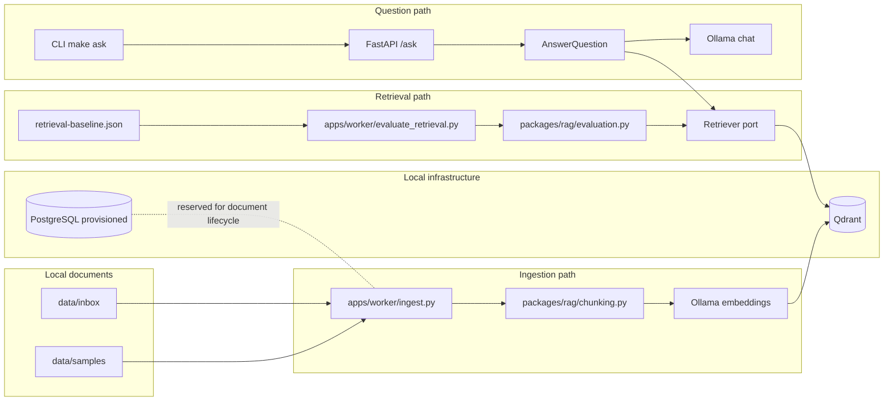
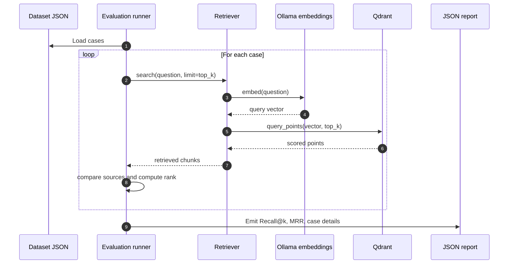
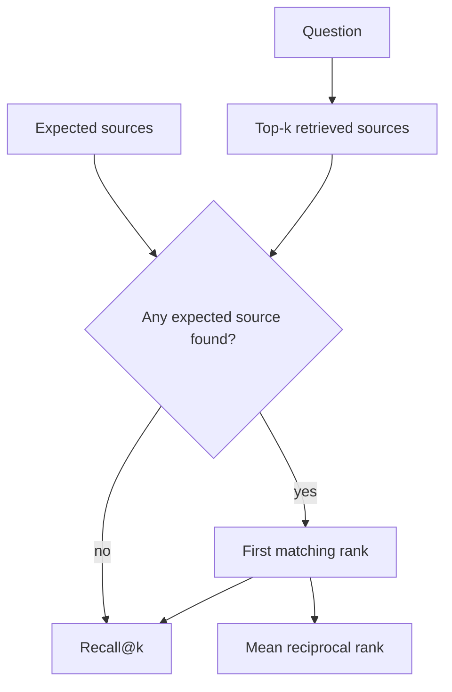

<p align="center">
  
</p>

<p align="center">
  
  
  
  
  
</p>

# Retrieval Evaluation

This document describes the first evaluation layer for the DevMind OS retrieval
pipeline. It is designed for engineering review: explicit scope, reproducible
commands, measurable output, known limitations, and clear next steps.

The current evaluation is intentionally small. It validates the shape of the
system and creates a repeatable baseline for future retrieval changes. It is not
a production benchmark.

## Executive Summary

| Area | Current position |
| --- | --- |
| Evaluation target | Retrieval only |
| Dataset | `data/evaluation/retrieval-baseline.json` |
| Sample corpus | `data/samples/` |
| Primary metrics | `Recall@k`, MRR |
| Runtime dependencies | Ollama, Qdrant, Docker Compose |
| Local E2E evidence | `Recall@2 = 1.0`, `MRR = 0.75`, API and CLI answered `Farol Verde.` |
| Review posture | Useful smoke signal, not sufficient for production quality claims |

## System Context



## Evaluation Flow



## Scope

The evaluation covers retrieval only:

1. load a versioned dataset of questions and expected sources;
2. run each question through the configured `Retriever`;
3. compare retrieved sources with expected file paths, chunk indexes, and
   optional document IDs;
4. report `Recall@k`, MRR, and per-case retrieved source metadata.

It does not judge generated answer quality, factual faithfulness, latency SLOs,
or user experience. Those checks should be added as separate layers so failures
remain attributable.

## Why This Exists

RAG systems can fail in several places:

- the right document is not indexed;
- the right chunk exists but is not retrieved;
- the right chunk is retrieved too low in the ranking;
- the prompt receives context but the generator ignores it;
- the answer is correct once but regresses after a chunking or embedding change.

This first evaluation layer isolates retrieval. That keeps the signal
deterministic enough to be useful during code review and eventually CI.

## Dataset Contract

The baseline dataset lives at:

```text
data/evaluation/retrieval-baseline.json
```

Each case contains:

| Field | Required | Purpose |
| --- | --- | --- |
| `id` | yes | Stable case identifier |
| `question` | yes | Query sent to the retriever |
| `expected_facts` | no | Human-readable facts the case is meant to cover |
| `expected_sources` | yes | Source locations expected in the top-k results |

Example:

```json
{
  "id": "rag-smoke-codename",
  "question": "Qual e o codinome operacional do teste RAG?",
  "expected_facts": ["Farol Verde"],
  "expected_sources": [
    {
      "file_path": "data/samples/rag-smoke-test.md",
      "chunk_index": 0
    }
  ]
}
```

`expected_facts` is recorded for traceability, but current metrics compare
retrieved sources only. Answer-level evaluation should be added separately.

## Metrics



### Recall@k

`Recall@k` answers: did the retriever return at least one expected source within
the first `k` results?

For this baseline, a case is considered a hit when any retrieved source matches
one expected source by:

- `file_path`;
- `chunk_index`, when provided;
- `document_id`, when provided.

### MRR

MRR, or mean reciprocal rank, rewards expected sources appearing earlier in the
ranking.

| First matching rank | Reciprocal rank |
| --- | --- |
| 1 | `1.0` |
| 2 | `0.5` |
| 3 | `0.333...` |
| No match | `0.0` |

## Operator Panel

| Task | Command |
| --- | --- |
| Start local infrastructure | `make up` |
| Check running containers | `make ps` |
| Inspect installed Ollama models | `ollama list` |
| Ingest sample documents | `make ingest-samples` |
| Run retrieval evaluation | `make eval` |
| Run evaluation with custom top-k | `make eval args="--top-k 8"` |
| Start API | `make api` |
| Ask through CLI | `make ask q="Qual e o codinome operacional do teste RAG?"` |

Default model expectations:

| Capability | Default |
| --- | --- |
| Embeddings | `nomic-embed-text` |
| Chat generation | `llama3.2:1b` |
| Vector collection | `devmind_documents` |

## Latest Local Evidence

The following evidence was collected from a local E2E run on 2026-06-24:

| Check | Result |
| --- | --- |
| Sample ingestion | `2/2` files, `2` chunks |
| Retrieval evaluation | `Recall@2 = 1.0`, `MRR = 0.75`, `2` cases |
| API health | HTTP 200 |
| API question flow | HTTP 200, answer `Farol Verde.` |
| CLI question flow | answer `Farol Verde.` |
| Automated checks | Ruff, mypy, pytest, and Compose config passed |

This evidence demonstrates that the current local pipeline can ingest sample
documents, retrieve relevant chunks, generate an answer through the API, and
return source metadata.

## Review Checklist

Use this checklist when reviewing retrieval changes:

| Review item | Expected evidence |
| --- | --- |
| Dataset | Case file path and number of cases |
| Ranking limit | `top-k` used in evaluation |
| Metrics | `Recall@k` and MRR before and after |
| Retrieval config | Changed chunking, embedding, scoring, or filtering settings |
| Collection state | Clean collection, rebuilt collection, or reused local data |
| Known gaps | Cases not represented by the dataset |
| Regression risk | Expected impact on existing `/ask` behavior |

Do not use a single successful generated answer as evidence that retrieval
quality improved. Prefer reproducible cases and explicit metrics.

## Known Limitations

| Limitation | Impact | Current mitigation |
| --- | --- | --- |
| Small dataset | Metrics are smoke signals, not broad quality claims | Documented as baseline only |
| Shared Qdrant collection | Stale local documents can affect ranking | Report includes retrieved source metadata |
| Retrieval-only metrics | Does not prove answer faithfulness | Keep answer evaluation as separate next layer |
| Non-idempotent lifecycle | Deleted or changed docs can leave obsolete chunks | Planned document lifecycle phase |
| Local dependency drift | Scores and rankings can move across versions | Record local evidence and dependency versions |

## Decision Record

| Decision | Rationale |
| --- | --- |
| Evaluate retrieval before generation | Isolates the first high-impact RAG failure mode |
| Keep dataset in JSON | Simple to review, version, and extend |
| Match by source metadata | Avoids brittle text comparison and content leakage in reports |
| Emit JSON reports | Easy to inspect locally and automate later |
| Avoid CI gate for now | Dataset is too small to act as a reliable quality gate |

## Next Steps

1. Add cases covering absence of context, ambiguous queries, and competing
   documents.
2. Isolate evaluation data in a dedicated collection or rebuild the collection
   before evaluation.
3. Add retrieval latency measurements.
4. Add answer-level checks for citation support and factual consistency.
5. Promote stable retrieval metrics into CI only after the dataset is large
   enough to provide useful signal.
